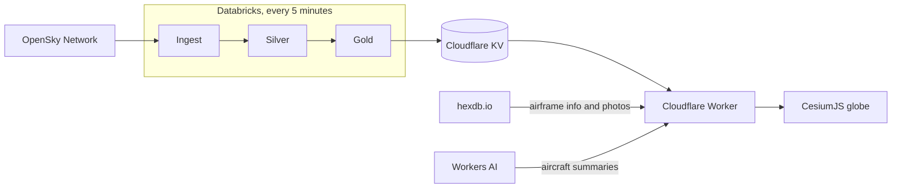

# Waypoint

A live 3D map of aircraft around the globe, built on [OpenSky Network](https://opensky-network.org/) data.

**[Live demo](https://waypoint.vandersteencobe.workers.dev/)**

Coverage depends on where OpenSky receives data, which varies by region and time of day.

## Features

- ✈️ A 3D model for each aircraft category, from light aircraft and helicopters to airliners and heavies
- 🔍 Search by callsign or ICAO address, with a count of matching aircraft
- 🖼️ A details panel with a photo of the airframe and a short AI-written summary
- 🌍 Smooth movement between position updates, without reloading the page

## How it works

## Repository layout

| Folder                               | Contents                                                            |
| ------------------------------------ | ------------------------------------------------------------------- |
| [`apps/etl`](apps/etl)               | Databricks pipeline that ingests, cleans and serves the flight data |
| [`apps/site`](apps/site)             | Cloudflare Worker and the CesiumJS front end                        |
| [`apps/monitoring`](apps/monitoring) | Databricks dashboard that tracks compute usage                      |

## Roadmap

Planned work is tracked in [GitHub issues](https://github.com/co-byte/waypoint/issues).

## Credits

- Flight data: [OpenSky Network](https://opensky-network.org/)
- Airframe info and photos: [hexdb.io](https://hexdb.io/)
- 3D models: various authors via [Poly Pizza](https://poly.pizza/), [CC BY 3.0](https://creativecommons.org/licenses/by/3.0/), see [the model credits](apps/site/public/models/CREDITS.md)
- Basemap: [OpenFreeMap](https://openfreemap.org/), [© OpenMapTiles](https://www.openmaptiles.org/), data from [OpenStreetMap](https://www.openstreetmap.org/copyright)
- Terrain: [Mapzen, AWS Terrain Tiles](https://github.com/tilezen/joerd/blob/master/docs/attribution.md)
