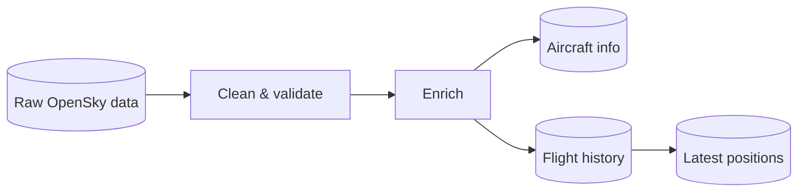
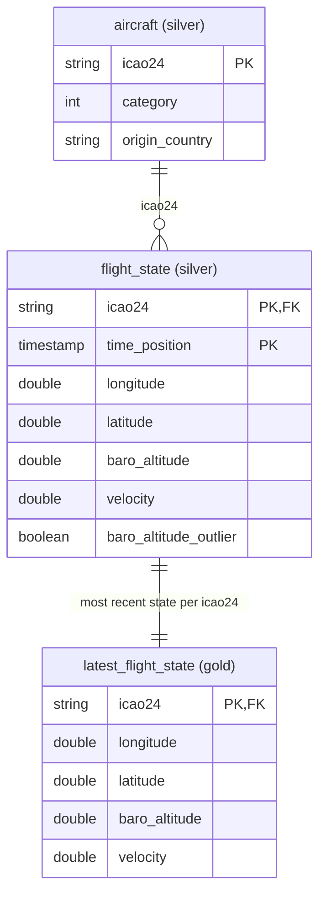

# Waypoint ETL

Databricks pipeline that ingests live aircraft positions from the OpenSky Network, cleans them and pushes the latest state to the [site](../site)'s Cloudflare KV. Part of [Waypoint](../../README.md).

## Pipeline

## Tables

