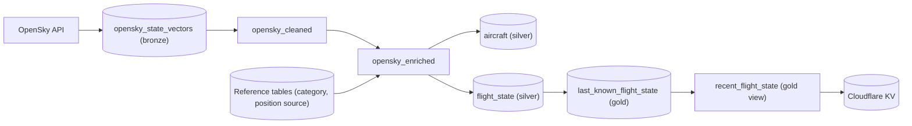
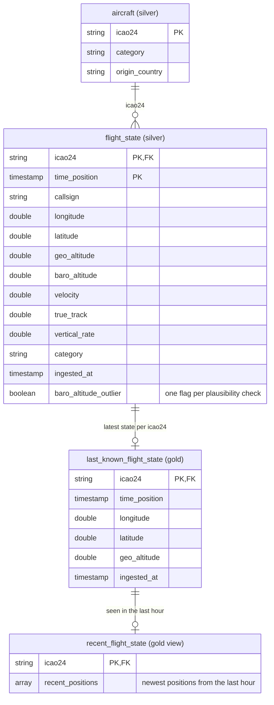

# Waypoint ETL

Databricks pipeline that ingests live aircraft positions from the OpenSky Network, cleans them and pushes the latest state to the [site](../site)'s Cloudflare KV. Part of [Waypoint](../../README.md).

## Pipeline

A job runs the pipeline every 5 minutes.

## Tables

`last_known_flight_state` has the same columns as `flight_state`, and `recent_flight_state` adds `recent_positions` to them; only the key columns are shown.
